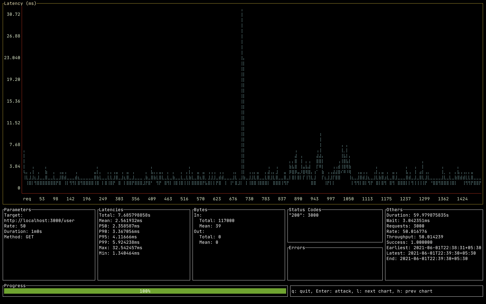

# gRPC Connection Load Test

### Agenda

Monitor TCP connections on user app container with a steady load.

1. Build binaries for user and consumer app
    ``` 
    make user-app
    make consumer-app
    ```
2. Build docker images
    ```
    docker composer build
    ```
3. Run images
    ```
    docker compose up
    ```
4. Find the user app container and exec into it
    ```
    docker ps
    docker exec -it grpc-user-app /bin/sh
    ```
5. Find active TCP connections to verify
    ```
    watch netstat -t
    ```
    
    
### User service
gRPC server with two services: Add User and Get User.
Returns dummy values

Check proto files : [proto](./user-app/proto/user.proto)


### Consumer App
HTTP server exposed to consumers, which calls user service internally to get users and add users.

`Endpoints`

BaseURL 

```
curl --location --request GET 'http://localhost:3000'
```

Get User 

```
curl --location --request GET 'http://localhost:3000/user'
```

Add User 

```
curl --location --request POST 'http://localhost:3000/user' \
--header 'Content-Type: application/json' \
--data-raw '{
    "name": "Nay",
    "age": "27"
}'
```


## Load testing
For installation of ali refer: https://github.com/nakabonne/ali

Usage:

`ali --rate=500 --duration=2m http://localhost:3000/user`

Result:
